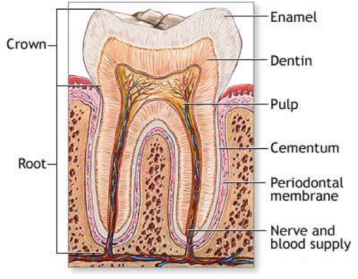
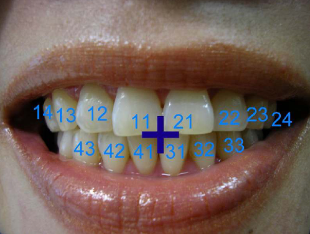
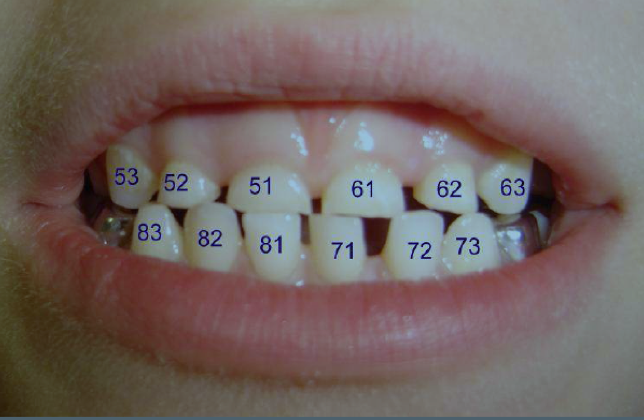
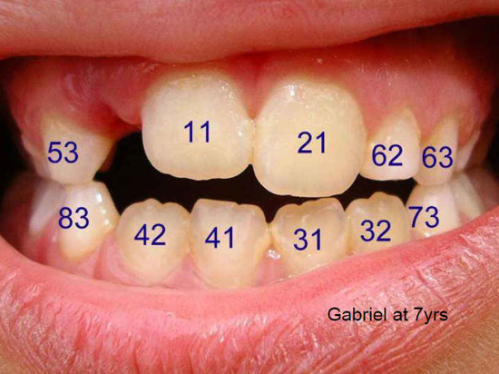

# Teeth Anatomy

_As tooth fairies only come at night when you are asleep no human eye has even beheld one. World renowned fairy expert Ms Saskia Hayes, after extensive research at the age of 5 years however was able to ascertain that they are a very closely related species to the well documented “Autumn Fairy”. Ms Hayes during her researches found it essential therefore to obtain an original print of a real Autumn fairy that was seen and hastily drawn from life by one of Australia’s greatest children’s book illustrators, Ida Rentoul Outhwaite in 1916. This is the last reliably documented sighting of a real Autumn Fairy. It was upon this basis she was able to convince her father to purchase the above print at great cost. It is essential for all Fairy experts to have a thorough working knowledge of when the “milk” teeth are lost if the “Holy Grail” of sighting a real tooth fairy is ever to be achieved. You need to be able to anticipate when they are likely to show themselves._ 

## Introduction

Dental complaints are a common presentation to the Emergency Department. 

Therefore, basic knowledge of teeth anatomy is required, as referral to other health practitioners is common in these cases, and so it is important for doctors working in the ED to be able to accurately describe dental pathology, using standard terminology.

## Anatomy

### Organization:

1.  There are 32 teeth in the permanent dentition, (16 upper, 16 lower, 8 on each side).
2.  On one side these are arranged into 4 morphologic groups:
    - 2 Incisors (1 central, 1 lateral)
    - 1 Canine
    - 2 Pre-molars
    - 3 Molars 

### Tooth structure:

Each tooth consists of **4 principle components**:

1.  The Enamel:
    - Enamel has no neurovascular supply connected to the pulp. 
    - Hence dental injuries isolated to the enamel should be painless.
    - Enamel is white. 
    
2.  The Dentin:
    - Dentin comprises the majority of a tooth.
    - It is a microporous substance consisting of a system of microtubules that allow communication with the pulp.
    - Dentin has a creamy yellow colour.

3.  The Pulp:
    - The pulp contains the neurovascular supply of the tooth, carrying nutrients to the dentin. 
    - Dentin is very temperature sensitive.

5.  Periodontal ligament:
    - The periodontal ligament (also known as the periodontal membrane) holds the tooth in place and acts as a barrier to surrounding osteoclasts. 
    - Any damage to this membrane may stimulate osteoclastic activity with 	subsequent destruction of the root over a period of months to years.

## The Deciduous and Permanent Teeth

Times of eruption of the teeth are as follows:

| Tooth             | Deciduous	    | Permanent     |
|:------------------|:--------------|:--------------|
| 1st molar         | 1 year        | 6 years       |
| Central incisor   | 6-8 months    | 7 years       |
| Lateral incisor   | 8-10 months   | 8 years       |
| 1st Pre-molar     | 8-10 months   | 9 years       |
| 2nd Pre-molar     | 8-10 months   | 10 years      |
| Canines           | 18 months     | 11 years      |
| 2nd Molar         | 2 years       | 12 years      |
| 3rd Molar         | 2 years       | 17-30 years   |

The deciduous teeth are also referred to as “milk teeth” “baby” or “primary” teeth.

The third molars are referred to in “lay” terms as the “wisdom” teeth. 

The teeth of the lower jaw in general appear before those of the upper jaw.

## Dental Nomenclature

### FDI Classification:

The FDI (Federation Dentaire Internationale) classification is used in Australia and worldwide. 

It involves dividing the mouth up into four quadrants, with teeth numbered accordingly, beginning with the (patient’s) right upper quadrant.

Primary (deciduous) teeth are also named in a similar fashion, beginning with 51.

It can be difficult to distinguish primary teeth from permanent teeth. 

However, the following points may help:
- Permanent teeth usually appear more yellow.
- If the patient is aged under 6 years old, all teeth are likely to be primary.
- If the patient is aged over 12 years old, all teeth are likely to be permanent.

In cases of mixed dentition (i.e. deciduous and permanent) a combination of the adult and child systems is used.

### Spatial Terminology:

#### Facial:
The part of tooth seen when a person smiles:
- Labial: Refers to the facial surface of incisors & canines
- Buccal: Refers to the facial surface of molars & premolars

#### Oral:
The part of tooth that faces the tongue/palate:
- Lingual: The oral surface of mandibular teeth, toward the tongue
- Palatal: The oral surface of maxillary teeth, toward the palate, 

#### Interproximal (also sometimes called approximal):
This refers to the contacting surfaces between 2 adjacent teeth:
- Mesial: The interproximal surface facing anteriorly/closest to midline
- Distal: The interproximal surface facing posterior/away from midline

#### Incisal:
This refers to the biting/chewing surface of the incisors and canines.

#### Occlusal:
This refers to the biting/chewing surface of the molars and premolars

## References:

1.	Snell’s Clinical Anatomy for Medical Students 5th ed. p.736.
2.	Emergency Dental Handbook for Medical Practitioners, Dr Tony Skapetis, 2010
3.	Personal communication with Dr Tony Skapetis, Faculty of Dentistry, University of Sydney, ACEM Dental Workshop Melbourne, 2010  

Dr J. Hayes

Dr Louisa Lee

Acknowledgments:
Dr Tony Skapetis
Reviewed 25 May 2014

